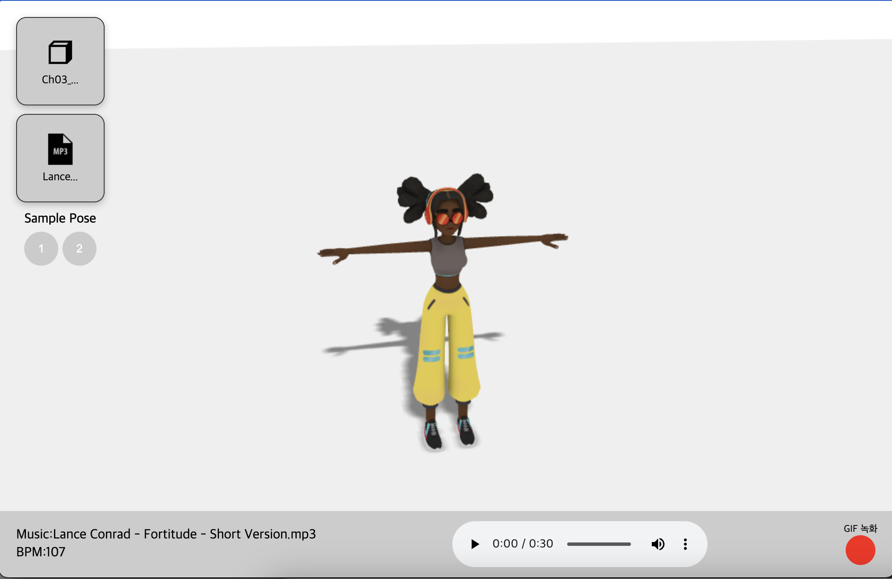

# 3D모델 애니메이션 만들기

- 프로젝트에 node_modules를 설치합니다.
```
npm i 
```

- npm start로 프로젝트를 실행합니다. 
    - 서버와 같이 실행됨.
    - ("start": "concurrently \"npm run server\" \"npm run dev\"")
    - 클라이언트: locallhost:9000
    - 서버: locallhost:3000
```
npm start
```

# 사용법



- 좌측 상단에 ⏹️(큐브) 아이콘을 클릭하여 .fbx 모델 파일을 첨부합니다.
    - 모델이 화면에 나타납니다.
- 좌측 상단에 🔊(사운드) 아이콘을 클릭하여 mp3,wav 오디오 파일을 첨부합니다.
    - 음악이 설정됩니다.
- (선택) Sample 포즈를 적용할 수 있습니다.
- 하단에 나타난 음악 플레이를 누르면 캐릭터가 춤을 춥니다.
- 빨간색 버튼을 누르면 프레임이 녹화가 됩니다. 한번더 누르면 중지가 되며 잠시 후에 gif 파일 다운로드 아이콘이 만들어집니다.
* (mac 유저 추가 설정없이 node-canvas 라이브러리 설치 안됨.)
```
    server
    - index.js

    //주석 처리후, 녹화 기능 제외
    const GIFEncoder = require('gifencoder');
    const { createCanvas, loadImage } = require('canvas');
```

## 바빌론JS FBX 파일 로드에 대한 고민 
- MIXAMO 모델들은 .fbx 파일로 되어 있습니다. 아쉽게도 바빌론.js는 .fbx를 지원하지 않습니다. 고민하던 중 'babylonjs-loader-fbx' 라는 라이브러리가 있길래 사용해 볼까 했는데 유지보수가 진행되지 않고 있더군요. 한번 클론을 통해 테스트 씬을 확인 보았는데 이 라이브러리 조차도 fbx를 로드하지 못하는 것을 확인했습니다. 그래서 결국 바빌론js 커뮤니티를 확인해보게 되었습니다.

- 커뮤티니 확인: https://forum.babylonjs.com/t/im-having-issues-after-loading-the-fbx-model/49363/4

fbx 파일을 바빌론js에서 바로 로드 하는법은 서버를 사용하여 변환시켜서 받는방법이 제일인 것을 확인했습니다. 결국 메타의 'FBX2glTF' 라이브러리를 사용하여 변환하여 사용하기로 하였습니다.


## GIF 내보내기
- 바빌론js는 'babylonjs-gifexporter'의 지원을 중단한것 같습니다. 그래서 CCapture.js 라이브러리를 알게 되었고 작업을 진행하였습니다. 
- 커뮤티니 확인: https://forum.babylonjs.com/t/import-gifexporter-with-webpack/5348/4

사용하였으나 웹팩과 같이 사용할 때 문제가 있어보입니다. 커뮤니티와 라이브러리의 깃 이슈를 확인해보면 웹팩과 같이 사용시 문제가 발생한다고 합니다. 해결법은 html에 스크립트 태그로 적용하는 것이며 feature/ccapture 브랜치로 작업을 진행하였습니다.
' gif.worker.js 문제 '

- gif 최신 관련 라이브러리가 따로 더 없는지 고민해보게 되었고 ccapture.js에 근간을 둔 'amandaghassaei/canvas-capture'라이브러리를 알게 되었습니다. 웹팩과 함께 작업이 가능하여 이렇게 진행하기로 하였습ㄴ디ㅏ.

canvas capture 라이브러리 또한 '경고'가 발생하는데 이슈가 아래와 같습니다.

Why import { CanvasCapture } from 'canvas-capture' cause cpu usage 99%?
- 링크: https://github.com/amandaghassaei/canvas-capture/issues/14

위의 '경고'는 ccapture.js의 (캔버스에 width와 height를 체크하는 기능) gif.worker.js 문제와 같습니다.
오류를 제대로 확인하려 해도 라이브러리 자체를 import하기만해도 컴퓨터의 발열을 발생합니다. 일단은 비동기로 라이브러리를 import 해주면 '경고'와 발열이 사라집니다.

```
async function setupCanvasCapture() {
    if (typeof window !== 'undefined') {
        const { CanvasCapture } = await import('canvas-capture');
    }
}
```

- 클라이언트 측 GIF 생성시 브라우저 메모리 사용량이 엄청남.
- 서버로 보내는것으로 해결해야할것 같은데 m1 칩 canvas 라이브러리 설치가 안됨.

- window로 작업하기로 결정.

